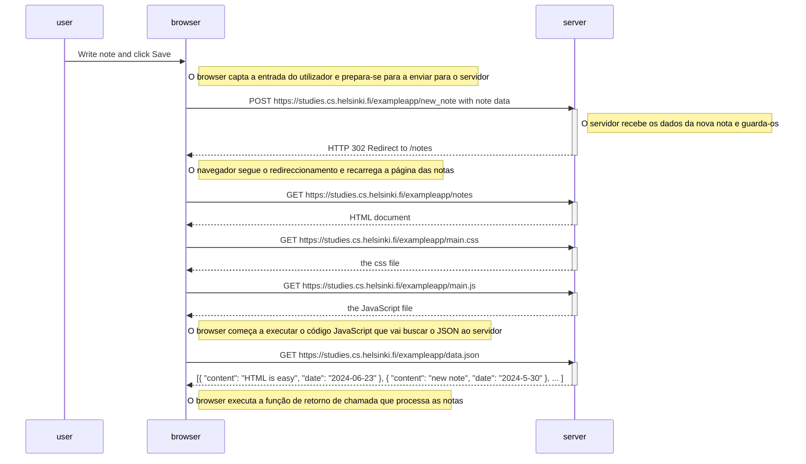
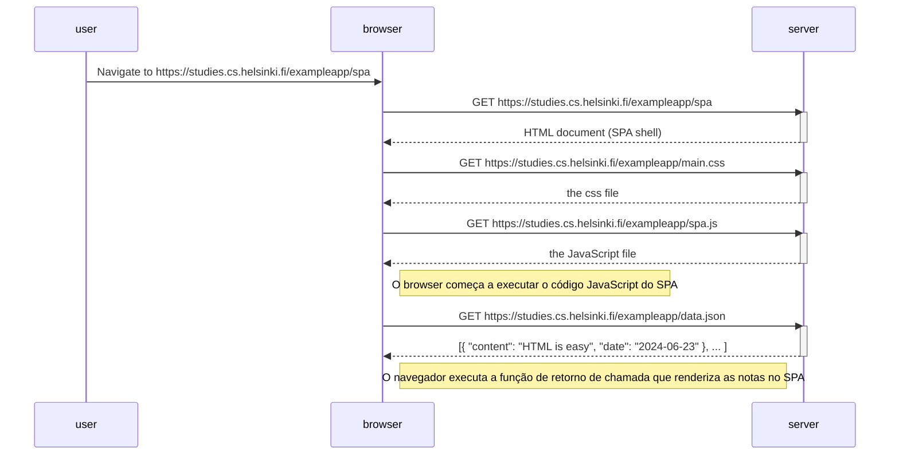
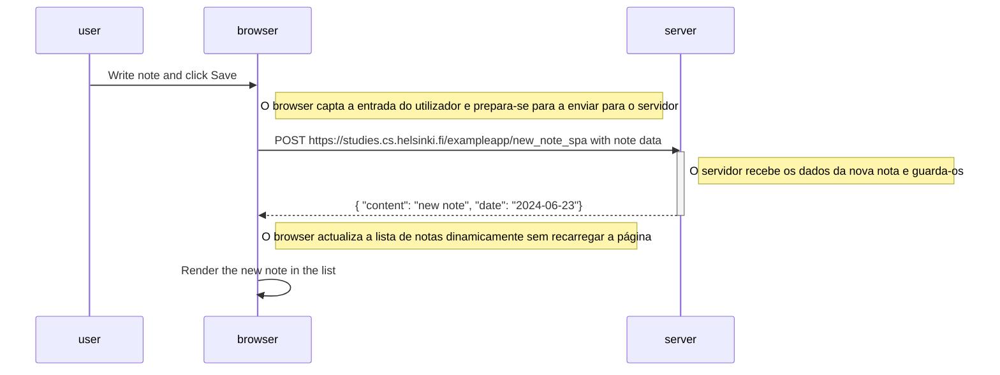

```mermaid
sequenceDiagram
    participant user
    participant browser
    participant server

    user->>browser: Write note and click Save
    Note right of browser: O browser capta a entrada do utilizador e prepara-se para a enviar para o servidor


    browser->>server: POST https://studies.cs.helsinki.fi/exampleapp/new_note with note data
    activate server
    Note right of server: O servidor recebe os dados da nova nota e guarda-os


    server-->>browser: HTTP 302 Redirect to /notes
    deactivate server

    Note right of browser: O navegador segue o redireccionamento e recarrega a página das notas


    browser->>server: GET https://studies.cs.helsinki.fi/exampleapp/notes
    activate server
    server-->>browser: HTML document
    deactivate server

    browser->>server: GET https://studies.cs.helsinki.fi/exampleapp/main.css
    activate server
    server-->>browser: the css file
    deactivate server

    browser->>server: GET https://studies.cs.helsinki.fi/exampleapp/main.js
    activate server
    server-->>browser: the JavaScript file
    deactivate server

    Note right of browser: O browser começa a executar o código JavaScript que vai buscar o JSON ao servidor
        

    browser->>server: GET https://studies.cs.helsinki.fi/exampleapp/data.json
    activate server
    server-->>browser: [{ "content": "HTML is easy", "date": "2024-06-23" }, { "content": "new note", "date": "2024-5-30" }, ... ]
    deactivate server

    Note right of browser: O browser executa a função de retorno de chamada que processa as notas


```

```mermaid
sequenceDiagram
    participant user
    participant browser
    participant server

    user->>browser: Navigate to https://studies.cs.helsinki.fi/exampleapp/spa
    browser->>server: GET https://studies.cs.helsinki.fi/exampleapp/spa
    activate server
    server-->>browser: HTML document (SPA shell)
    deactivate server

    browser->>server: GET https://studies.cs.helsinki.fi/exampleapp/main.css
    activate server
    server-->>browser: the css file
    deactivate server

    browser->>server: GET https://studies.cs.helsinki.fi/exampleapp/spa.js
    activate server
    server-->>browser: the JavaScript file
    deactivate server

    Note right of browser:  O browser começa a executar o código JavaScript do SPA

    browser->>server: GET https://studies.cs.helsinki.fi/exampleapp/data.json
    activate server
    server-->>browser: [{ "content": "HTML is easy", "date": "2024-06-23" }, ... ]
    deactivate server

    Note right of browser:  O navegador executa a função de retorno de chamada que renderiza as notas no SPA

```

```mermaid
sequenceDiagram
    participant user
    participant browser
    participant server

    user->>browser: Write note and click Save
    Note right of browser: O browser capta a entrada do utilizador e prepara-se para a enviar para o servidor

    browser->>server: POST https://studies.cs.helsinki.fi/exampleapp/new_note_spa with note data
    activate server
    
    Note right of server:  O servidor recebe os dados da nova nota e guarda-os

    server-->>browser: { "content": "new note", "date": "2024-06-23"}
    deactivate server

    Note right of browser: O browser actualiza a lista de notas dinamicamente sem recarregar a página

    browser->>browser: Render the new note in the list

```